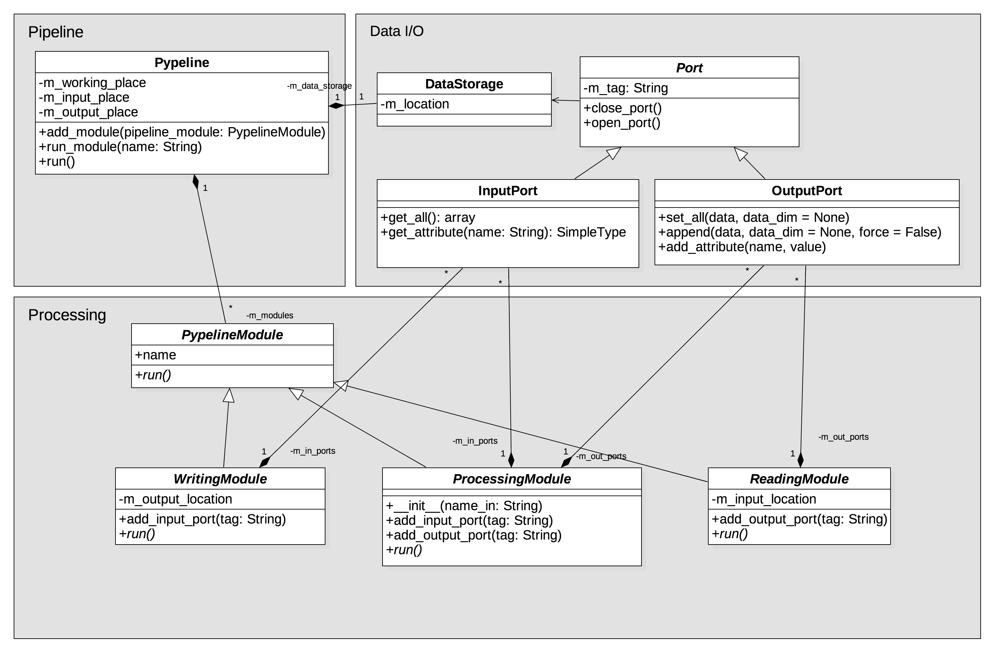
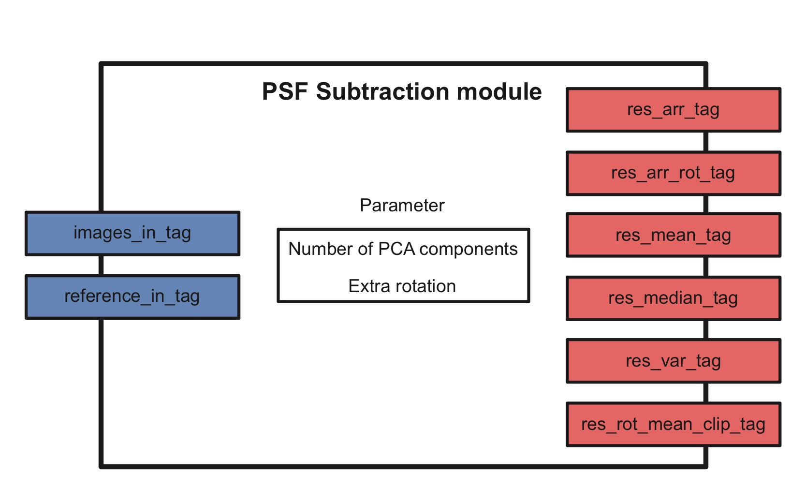

.. _architecture:

Architecture
============

PynPoint has evolved from PSF subtraction toolkit to an end-to-end pipeline from processing and analysis of high-contrast imaging data obtained with the angular differential imaging (ADI) technique. The architecture of PynPoint has been redesigned in version 0.3.0 with the goal to create a pipeline which inheres a list of processing modules, one for each data reduction and analysis step. In addition, the pipeline architecture is extendable for new data processing techniques and data types in future. An overview of the available IO and processing modules is provide in the :ref:`pynpoint-package` section.

The actual pipeline and processing functionalities are implemented in a different subpackages. Therefore it is possible to extend the processing functionalities of the pipeline without changing the core of the pipeline.

The UML class diagram below illustrates the pipeline architecture of PynPoint:

The diagram shows that the architecture is subdivided in three components:

	* Data management
	* Pipeline modules for reading, writing, and processing of data
	* The actual pipeline

.. _database:

Central Database
----------------

The new architecture of PynPoint separates the data management from the data reduction steps for the following reasons:

	1. Raw datasets can be very large, in particular in the 3--5 μm wavelength regime, which challenges the processing on a computer with a small amount of memory (RAM). A central database is used to store the data on a computer's hard drive.
	2. Some data is used in different steps of the pipeline. A central database makes it easy to access that data without making a copy.
	3. The central data storage on the hard drive will remain updated after each step. Therefore, processing steps that already finished remain unaffected if an error occurs or the data reduction is interrupted by the user.

Understanding the central data storage classes is important if you plan to write your own Pipeline modules (see :ref:`writing`). When running the pipeline, it is enough to understand the concept of database tags.

As already encountered in the :ref:`end-to-end` section, each pipeline module has input and/or output tags. A tag is a label of a specific dataset in the central database. A module with ``image_in_tag=im_arr`` will look for a stack of input images in the central database under the tag name `im_arr`. Similarly, a module with ``image_out_tag=im_arr_processed`` will a stack of processed images to the central database under the tag `im_arr_processed`. Note that input tags will never change the data in the database.

Accessing the data storage occurs through instances of :class:`PynPoint.Core.DataIO.Port` which allow pipeline modules to read data from and write data to central database.

.. _modules:

Modules
-------

A pipeline module has a specific task that is appended to the internal queue of pipeline tasks. A module can read and write data tags from and to the central database through dedicated input and output connections. As illustration, this is the input and output structure of the :class:`PynPoint.ProcessingModules.PSFSubtractionPCA.PSFSubtractionModule`:

The module requires two input tags (blue) which means that two internal input ports are used to access data from the central database. The first port imports the science images and the second port imports the reference images that are used to calculate the PSF model using principle component analysis (PCA). In this case, both input tags can have the same name and therefore point to the same data set. 

The module parameters are listed in the center of the illustration, which includes the number of principle components and the additional derotation that is applied.

The output tags (red) are required to setup the internal output ports which store the results of the PSF subtraction (e.g., mean and variance of the residuals) to the central database.

In order to create a valid pipeline one should check that the required input tags are linked to data which was previously created by a pipeline module. In other words, there need to be a previous module with the same tag as output.

There are three types of pipeline modules:

	1. :class:`PynPoint.Core.Processing.ReadingModule` - A module with only output tags/ports, used to read data to the central database.
	2. :class:`PynPoint.Core.Processing.WritingModule` - A module with only input tags/ports, used to export data from the central database.
	3. :class:`PynPoint.Core.Processing.ProcessingModule` - A module with both input and output tags/ports, used for processing of the data.

.. _pipeline:

Pipeline
--------

The :class:`PynPoint.Core.Pypeline` module is the central component which manages the order and execution of the different pipeline modules. Each ``Pypeline`` instance has an ``working_place_in`` path which is where the central database and configuration file are stored, an ``input_place_in`` path which is the default data location for reading modules, and an ``output_place_in`` path which is the default output path where the data will be saved by the writing modules: ::

    pipeline = Pypeline(working_place_in="/path/to/working_place",
                        input_place_in="/path/to/input_place",
                        output_place_in="/path/to/output_place")

A pipeline module is appended to the queue of modules as: ::

    pipeline.add_module("module")

And can be removed from the queue with the following ``Pypeline`` method: ::

    pipeline.remove_module("module")

The names and order of the pipeline modules are listed with: ::

    pipeline.get_module_names()

Running all modules attached to the pipeline is achieved with: ::

    pipeline.run()

Or a single module is executed as: ::

    pipeline.run_module("name")

Both run methods will check if the pipeline has valid input and output tags.

An instance of ``Pypeline`` can be used to directly access data from the central database. See the :ref:`hdf5-files` section for more information.
