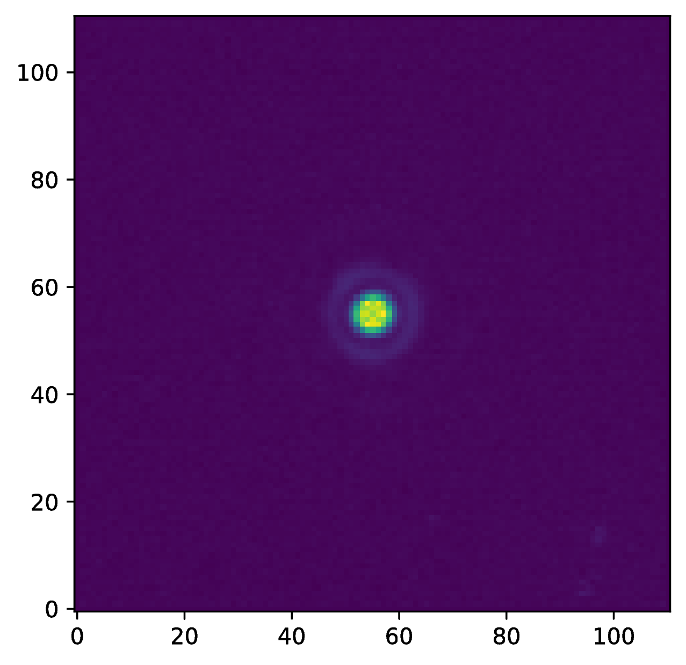
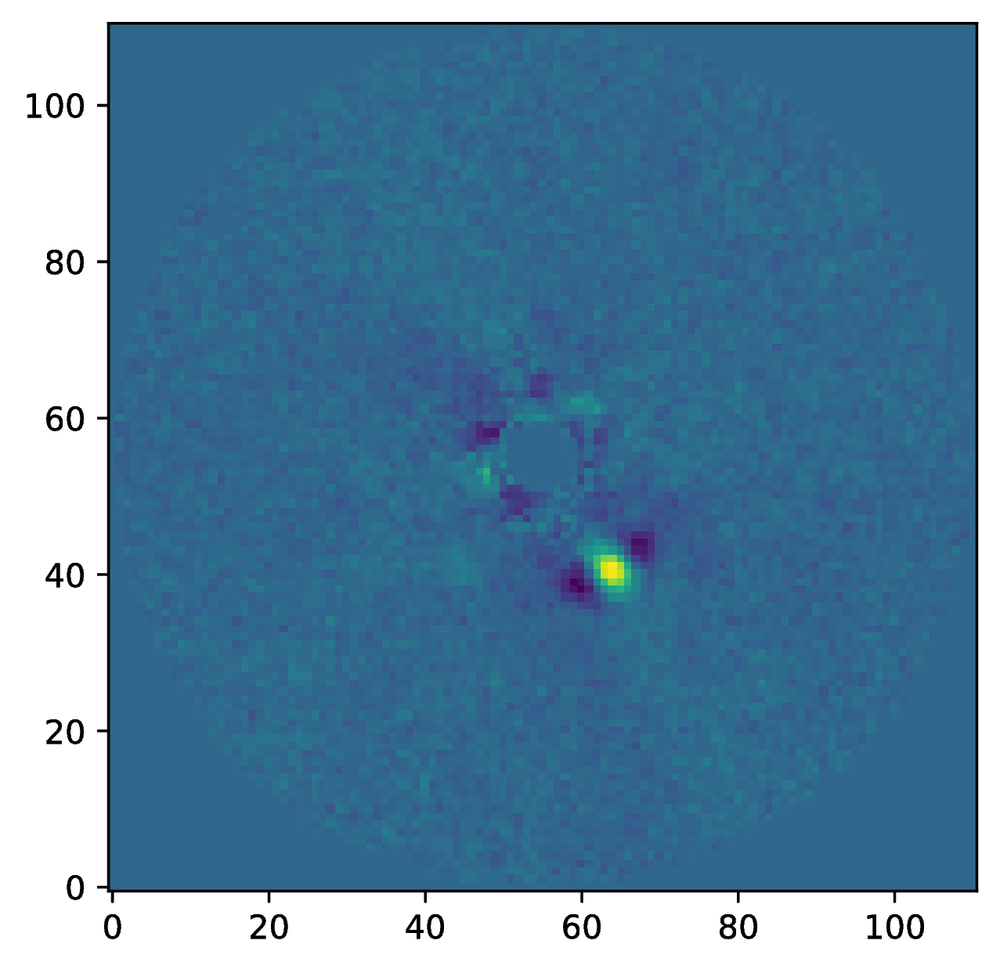
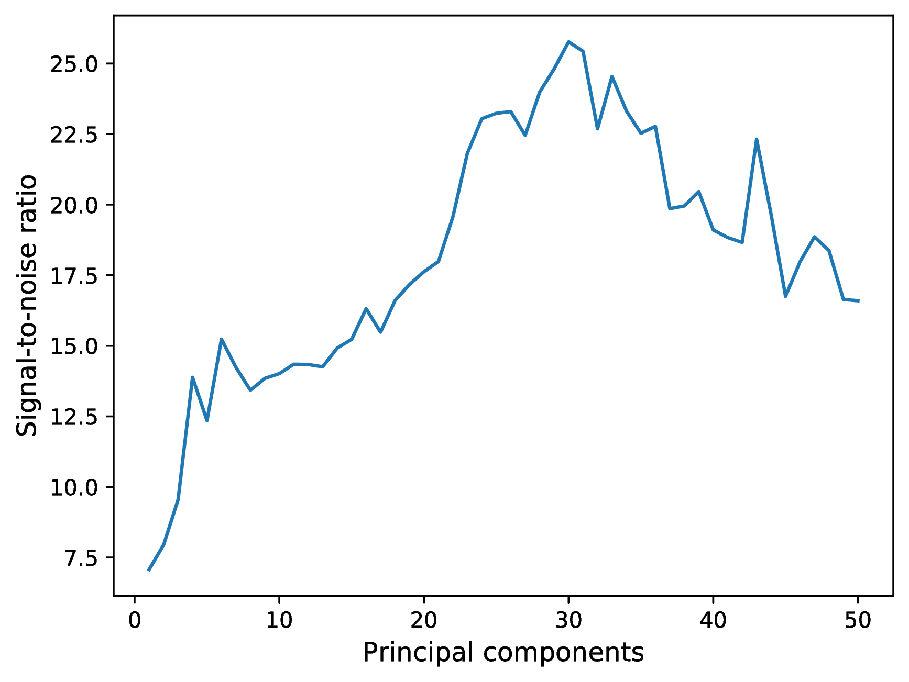

.. _examples:

Examples
--------

VLT/SPHERE H-alpha data
~~~~~~~~~~~~~~~~~~~~~~~

An end-to-end example of a `SPHERE/ZIMPOL <https://www.eso.org/sci/facilities/paranal/instruments/sphere.html>`_ H-alpha data set of the accreting M dwarf companion of HD 142527 (see `Cugno et al. 2019 <https://ui.adsabs.harvard.edu/abs/2019A%26A...622A.156C>`_) can be downloaded `here <https://people.phys.ethz.ch/~stolkert/pynpoint/hd142527_zimpol_h-alpha.tgz>`_.

VLT/NACO Mp dithering data
~~~~~~~~~~~~~~~~~~~~~~~~~~

Here we show a processing example of a pupil-stabilized data set of beta Pic from `Stolker et al. (2019) <https://ui.adsabs.harvard.edu/abs/2019A%26A...622A.156C>`_ (see also :ref:`running`). This archival data set was obtained with `VLT/NACO <https://www.eso.org/sci/facilities/paranal/instruments/naco.html>`_ in the Mp band, which can be downloaded from the ESO archive under program ID |data|. A dithering pattern was applied to sample the sky background. Before starting the data reduction, it is useful to sort the various required science and calibration files into separate folders. Also, it is important to provide the correct NACO keywords in the configuration file (see :ref:`configuration`).

Now we can start the data reduction by first importing the Pypeline and the required pipeline modules. These can be directly imported from the package, for example:

.. code-block:: python

   from pynpoint import Pypeline, FitsReadingModule

Next, we create an instance of :class:`~pynpoint.core.pypeline.Pypeline` with the ``working_place_in`` pointing to a path where PynPoint has enough space to create its database, ``input_place_in`` pointing to the default input path, and ``output_place_in`` to a folder to store results that are exported from the database, for example as FITS file:

.. code-block:: python

   pipeline = Pypeline(working_place_in='/path/to/working_place',
                       input_place_in='/path/to/input_place',
                       output_place_in'/path/to/output_place')

The FWHM of the PSF is defined for simplicity:

.. code-block:: python

   fwhm = 0.134 # [arcsec]

Now we are ready to add all the pipeline modules that we need. Have a look at the documentation in the :ref:`pynpoint-package` section for a detailed description of the individual modules and their parameters. 

1. We start by importing the raw science images with a DIT of 65 ms into the database:

.. code-block:: python

   module = FitsReadingModule(name_in='read1',
                              input_dir='/path/to/science/',
                              image_tag='science',
                              overwrite=True,
                              check=True)

   pipeline.add_module(module)
   pipeline.run_module('read1')

There are 55384 images of (y, x) = (386, 384) pixels in size:

.. code-block:: python

   print(pipeline.get_shape('science'))

.. code-block:: console

   (55384, 386, 384)

2. We also import the raw flat (DIT = 56 ms) and dark images (DIT = 56 ms):

.. code-block:: python

   module = FitsReadingModule(name_in='read2',
                              input_dir='/path/to/flat/',
                              image_tag='flat',
                              overwrite=True,
                              check=False)

   pipeline.add_module(module)
   pipeline.run_module('read2')

   module = FitsReadingModule(name_in='read3',
                              input_dir='/path/to/dark/',
                              image_tag='dark',
                              overwrite=True,
                              check=False)

   pipeline.add_module(module)
   pipeline.run_module('read3')

There are 5 flat fields and 3 dark frames, both 514 x 512 pixels in size:

.. code-block:: python

   print(pipeline.get_shape('flat'))
   print(pipeline.get_shape('dark'))

.. code-block:: console

   (5, 514, 512)
   (3, 514, 512)

3. Remove every NDIT+1 frame from the science data, which contains the average of the FITS cube (NACO specific):

.. code-block:: python

   module = RemoveLastFrameModule(name_in='last',
                                  image_in_tag='science',
                                  image_out_tag='science_last')

   pipeline.add_module(module)
   pipeline.run_module('last')

.. code-block:: python

   print(pipeline.get_shape('science'))

.. code-block:: console

   (55200, 386, 384)

4. Calculate the parallactic angles for each image:

.. code-block:: python

   module = AngleCalculationModule(name_in='angle',
                                   data_tag='science_last',
                                   instrument='NACO')

   pipeline.add_module(module)
   pipeline.run_module('angle')

The angles are stored as attributes to the `science_last` dataset and will be copied and updated automatically as we continue the data reduction. To get the angles from the database:

.. code-block:: python

   parang = pipeline.get_attribute('science_last', 'PARANG', static=False)
   print(parang)

.. code-block:: console

   [-109.75667269 -109.75615294 -109.75563318 ... -57.98983035 -57.98936535 -57.98890035]

5. Remove the top and bottom line to make the images square:

.. code-block:: python

   module = RemoveLinesModule(lines=(0, 0, 1, 1),
                              name_in='cut1',
                              image_in_tag='science_last',
                              image_out_tag='science_cut')

   pipeline.add_module(module)

   module = RemoveLinesModule(lines=(0, 0, 1, 1),
                              name_in='cut2',
                              image_in_tag='flat',
                              image_out_tag='flat_cut')

   pipeline.add_module(module)

   module = RemoveLinesModule(lines=(0, 0, 1, 1),
                              name_in='cut3',
                              image_in_tag='dark',
                              image_out_tag='dark_cut')

   pipeline.add_module(module)

   pipeline.run_module('cut1')
   pipeline.run_module('cut2')
   pipeline.run_module('cut3')

   print(pipeline.get_shape('science_cut'))
   print(pipeline.get_shape('flat_cut'))
   print(pipeline.get_shape('dark_cut'))

.. code-block:: console

   (55200, 384, 384)
   (5, 512, 512)
   (3, 512, 512)

6. Subtract the dark current from the flat field:

.. code-block:: python

   module = DarkCalibrationModule(name_in='dark',
                                  image_in_tag='flat_cut',
                                  dark_in_tag='dark_cut',
                                  image_out_tag='flat_cal')

   pipeline.add_module(module)
   pipeline.run_module('dark')

7. Divide the science data by the master flat (the `flat_cal` images are automatically cropped around their center):

.. code-block:: python

   module = FlatCalibrationModule(name_in='flat',
                                  image_in_tag='science_cut',
                                  flat_in_tag='flat_cal',
                                  image_out_tag='science_cal')

   pipeline.add_module(module)
   pipeline.run_module('flat')

8. Remove the first 5 frames from each FITS cube because of the systematically higher background emission:

.. code-block:: python

   module = RemoveStartFramesModule(frames=5,
                                    name_in='first',
                                    image_in_tag='science_cal',
                                    image_out_tag='science_first')

   pipeline.add_module(module)
   pipeline.run_module('first')

   print(pipeline.get_shape('science_first'))

.. code-block:: console

   (54280, 384, 384)

9. Now we sort out the star and background images and apply a mean background subtraction:

.. code-block:: python

   module = DitheringBackgroundModule(name_in='background',
                                      image_in_tag='science_first',
                                      image_out_tag='science_background',
                                      center=((263, 263), (116, 263), (116, 116), (263, 116)),
                                      cubes=None,
                                      size=3.5,
                                      crop=True,
                                      prepare=True,
                                      pca_background=False,
                                      combine='mean')

   pipeline.add_module(module)
   pipeline.run_module('background')

10. Bad pixel correction:

.. code-block:: python

   module = BadPixelSigmaFilterModule(name_in='bad',
                                     image_in_tag='science_background',
                                     image_out_tag='science_bad',
                                     map_out_tag=None,
                                     box=9,
                                     sigma=5.,
                                     iterate=3)

   pipeline.add_module(module)
   pipeline.run_module('bad')

11. Frame selection:

.. code-block:: python

   module = FrameSelectionModule(name_in='select',
                                 image_in_tag='science_bad',
                                 selected_out_tag='science_selected',
                                 removed_out_tag='science_removed',
                                 index_out_tag=None,
                                 method='median',
                                 threshold=2.,
                                 fwhm=fwhm,
                                 aperture=('circular', fwhm),
                                 position=(None, None, 4.*fwhm))

   pipeline.add_module(module)
   pipeline.run_module('select')

12. Extract the star position and center with pixel precision:

.. code-block:: python

   module = StarExtractionModule(name_in='extract',
                                 image_in_tag='science_selected',
                                 image_out_tag='science_extract',
                                 index_out_tag=None,
                                 image_size=3.,
                                 fwhm_star=fwhm,
                                 position=(None, None, 4.*fwhm))

   pipeline.add_module(module)
   pipeline.run_module('extract')

13. Align the images with a cross-correlation of the central 800 mas:

.. code-block:: python

   module = StarAlignmentModule(name_in='align',
                                image_in_tag='science_extract',
                                ref_image_in_tag=None,
                                image_out_tag='science_align',
                                interpolation='spline',
                                accuracy=10,
                                resize=None,
                                num_references=10,
                                subframe=0.8)

   pipeline.add_module(module)
   pipeline.run_module('align')

14. Center the images with subpixel precision by applying a constant shift:

.. code-block:: python

   module = FitCenterModule(name_in='center',
                            image_in_tag='science_align',
                            fit_out_tag='fit',
                            mask_out_tag=None,
                            method='mean',
                            radius=5.*fwhm,
                            sign='positive',
                            model='gaussian',
                            filter_size=None,
                            guess=(0., 0., 1., 1., 100., 0., 0.))

   pipeline.add_module(module)
   pipeline.run_module('center')

   module = ShiftImagesModule(name_in='shift',
                              image_in_tag='science_align',
                              image_out_tag='science_center',
                              shift_xy='fit',
                              interpolation='spline')

   pipeline.add_module(module)
   pipeline.run_module('shift')

To read the first image from the `science_center` dataset:

.. code-block:: python

   image = pipeline.get_data('science_center', data_range=(0, 1))
   print(image.shape)

.. code-block:: console

   (1, 111, 111)

And to plot the image:

.. code-block:: python

   import matplotlib.pyplot as plt
   plt.imshow(image[0, ], origin='lower')
   plt.show()

15. Now we stack every 100 images to lower the computation time with the PSF subtraction:

.. code-block:: python

   module = StackAndSubsetModule(name_in='stack',
                                 image_in_tag='science_center',
                                 image_out_tag='science_stack',
                                 random=None,
                                 stacking=100)

   pipeline.add_module(stack)
   pipeline.run_module('stack')

16. Prepare the data for PSF subtraction:

.. code-block:: python

   module = PSFpreparationModule(name_in='prep',
                                 image_in_tag='science_stack',
                                 image_out_tag='science_prep',
                                 mask_out_tag=None,
                                 norm=False,
                                 resize=None,
                                 cent_size=fwhm,
                                 edge_size=1.)

   pipeline.add_module(module)
   pipeline.run_module('prep')

17. PSF subtraction with PCA:

.. code-block:: python

   module = PcaPsfSubtractionModule(pca_numbers=range(1, 51),
                                    name_in='pca',
                                    images_in_tag='science_',
                                    reference_in_tag='science_',
                                    res_median_tag='pca_median',
                                    extra_rot=0.)

   pipeline.add_module(module)
   pipeline.run_module('pca')

This is what the median residuals look like after subtraction 10 principal components:

.. code-block:: python

   data = pipeline.get_data('pca_median')

   plt.imshow(data[9, ], origin='lower')
   plt.show()

18. Measure the signal-to-noise ratio (S/N) and false positive fraction at the position of the planet:

.. code-block:: python

   module = FalsePositiveModule(position=(50.5, 26.5),
                                aperture=fwhm/2.,
                                ignore=True,
                                name_in='fpf',
                                image_in_tag='pca_median',
                                snr_out_tag='fpf')

   pipeline.add_module(module)
   pipeline.run_module('fpf')

And to plot the S/N ratio for the range of principal components:

.. code-block:: python

   data = pipeline.get_data('snr')
   plt.plot(range(1, 51), data[:, 4])
   plt.xlabel('Principal components', fontsize=12)
   plt.ylabel('Signal-to-noise ratio', fontsize=12)
   plt.show()

19. Write the median residuals to a FITS file:

.. code-block:: python

   module = FitsWritingModule(name_in='write',
                              file_name='residuals.fits',
                              output_dir=None,
                              data_tag='pca_median',
                              data_range=None)

   pipeline.add_module(module)
   pipeline.run_module('write')

.. |data| raw:: html

   <a href="http://archive.eso.org/wdb/wdb/eso/sched_rep_arc/query?progid=090.C-0653(D)" target="_blank">090.C-0653(D)</a>
