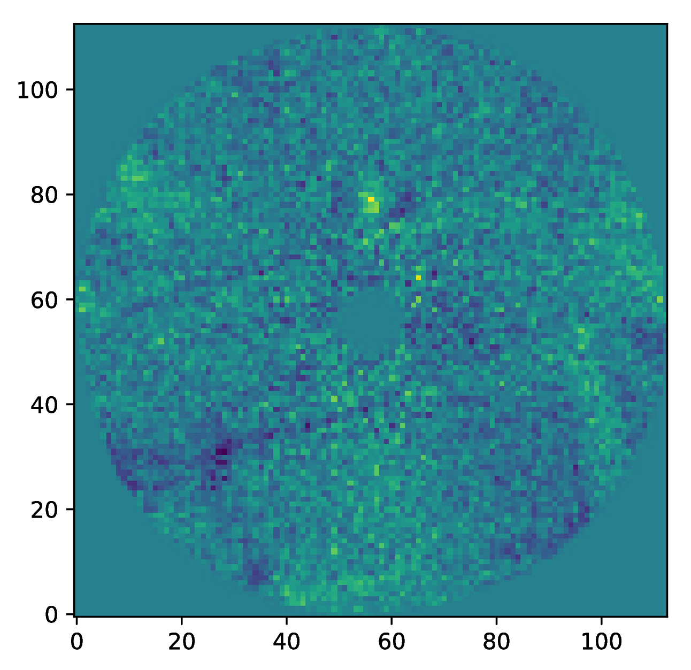

.. _near_data:

Data Reduction
==============

.. _near_intro:

Introduction
------------

The documentation on this page contains an introduction into data reduction of the modified |visir| instrument for the |near| (New Earths in the
Alpha Cen Region) experiment. The basic processing steps with PynPoint are described in the example below while a complete overview of all available pipeline modules can be found in the :ref:`overview` section. To get started, installation instructions are available in the :ref:`installation` section. Please have a look at the :ref:`attribution` section when using PynPoint results in a publication. Further details about the pipeline architecture and data processing are also available in |stolker|.

.. _near_example:

Example
-------

The example data reduction is based on simulated data which can be downloaded |data|. The pipeline requires a folder for ``working_place``, ``input_place``, and ``output_place``. These are the working folder with the database and configuration file, the default data input folder, and default output folder for results, respectively.

Before we start running PynPoint, we have to sort the data in three different folders such that they can be read separately into the database. The folders can be provided with the ``input_dir`` parameter in the :class:`~pynpoint.readwrite.fitsreading.FitsReadingModule` that we will use. The FITS files contain a simulated reference PSF (`Ref_PSF_aCenA.fits`) and the coronagraphic data of Nod A (`set1.fits`) and Nod B (`set2.fits`).

A basic description of the pipeline modules is given in the comments of the example script. More in-depth information of all the input parameters can be found in the :ref:`api`.

First we create a configuration file which contains the global pipeline settings and is used to select the required FITS header keywords. Create a text file called ``PynPoint_config.ini`` in the ``working_place`` folder with the following content::

   [header]

   INSTRUMENT: INSTRUME
   NFRAMES: NAXIS3
   EXP_NO: ESO TPL EXPNO
   DIT: ESO DET SEQ1 DIT
   NDIT: ESO DET NDIT
   PARANG_START: ESO ADA POSANG
   PARANG_END: ESO ADA POSANG END
   DITHER_X: ESO SEQ CUMOFFSETX
   DITHER_Y: ESO SEQ CUMOFFSETY
   PUPIL: ESO ADA PUPILPOS
   DATE: DATE-OBS
   LATITUDE: ESO TEL GEOLAT
   LONGITUDE: ESO TEL GEOLON
   RA: RA
   DEC: DEC

   [settings]

   PIXSCALE:  0.045
   MEMORY: 100
   CPU: 4

The ``MEMORY`` and ``CPU`` setting can be adjusted. They define the number of images that is simultaneously loaded into the computer memory and the number of parallel processes that are used by some of the pipeline modules.

Pipeline modules are added sequentially to the pipeline and are executed either individually or all at once (see end of the example script). Each pipeline module requires a ``name_in`` tag which is used as identifier by the pipeline. All intermediate results (typically a stack of images) are stored in the database (`PynPoint_database.hdf5`) which allows the user to rerun particular processing steps without having to rerun the complete pipeline. The script below can now be executed as a text file from the command line, in Python interactive mode, or as a Jupyter notebook::

   # Import the Pypeline and the modules that we will use in this example

   from pynpoint import Pypeline, FitsReadingModule, AngleInterpolationModule, \
                        SubtractImagesModule, StackCubesModule, CropImagesModule, \
                        NoddingBackgroundModule, StarCenteringModule, PSFpreparationModule, \
                        PcaPsfSubtractionModule, ContrastCurveModule, FitsWritingModule, \
                        TextWritingModule

   # Create a Pypeline instance
   pipeline = Pypeline(working_place_in='working_folder/',
                       input_place_in='input_folder/',
                       output_place_in='output_folder/')

   # Read FITS file with Nod A data

   module = FitsReadingModule(name_in='read_nodA',
                              input_dir='nodA_folder/',
                              image_tag='nodA',
                              overwrite=True,
                              check=True)

   pipeline.add_module(module)

   # Read FITS file with Nod B data

   module = FitsReadingModule(name_in='read_nodB',
                              input_dir='nodB_folder/',
                              image_tag='nodB',
                              overwrite=True,
                              check=True)

   pipeline.add_module(module)

   # Read the FITS file with the non-coronagrahic reference PSF

   module = FitsReadingModule(name_in='read_psf',
                              input_dir='psf_folder/',
                              image_tag='psf',
                              overwrite=True,
                              check=True)

   pipeline.add_module(module)

   # Interpolate the parallactic angles between the start and end value

   module = AngleInterpolationModule(name_in='angle',
                                     data_tag='nodA')

   pipeline.add_module(module)

   # Background subtraction option 1
   # Subtract Nod B from Nod A on a frame-by-frame basis

   module = SubtractImagesModule(name_in='subtract',
                                 image_in_tags=('nodA', 'nodB'),
                                 image_out_tag='nodA_sub',
                                 scaling=1.)

   pipeline.add_module(module)

   # Background subtraction option 2:
   # Compute the mean background from each FITS cube of Nod B
   # and subtract from Nod A, based on the exposure number

   module = StackCubesModule(name_in='mean',
                             image_in_tag='nodB',
                             image_out_tag='nodB_mean',
                             combine='mean')

   pipeline.add_module(module)

   module = NoddingBackgroundModule(name_in='background',
                                    science_in_tag='nodA',
                                    sky_in_tag='nodB_mean',
                                    image_out_tag='nodA_sub',
                                    mode='both')

   pipeline.add_module(module)

   # Crop the Nod A and reference PSF to a 5 x 5 arcsecond image around the approximate center

   module = CropImagesModule(size=5.,
                             center=(256, 256),
                             name_in='crop1',
                             image_in_tag='nodA_sub',
                             image_out_tag='nodA_crop')

   pipeline.add_module(module)

   module = CropImagesModule(size=5.,
                             center=(256, 256),
                             name_in='crop2',
                             image_in_tag='psf',
                             image_out_tag='psf_crop')

   pipeline.add_module(module)

   # Center the Nod A data by smoothing and fitting the central part with a negative 2D Gaussian

   module = StarCenteringModule(name_in='center1',
                                image_in_tag='nodA_crop',
                                image_out_tag='nodA_center',
                                mask_out_tag='nodA_mask',
                                fit_out_tag='nodA_fit',
                                method='full',
                                interpolation='spline',
                                radius=0.3,
                                sign='negative',
                                model='gaussian',
                                filter_size=0.1,
                                guess=(0., 0., 10., 10., 1e5, 0., 0.))

   pipeline.add_module(module)

   # Center the reference PSF data by smoothing and fitting with a 2D Moffat function

   module = StarCenteringModule(name_in='center2',
                                image_in_tag='psf_crop',
                                image_out_tag='psf_center',
                                mask_out_tag='psf_mask',
                                fit_out_tag='psf_fit',
                                method='full',
                                interpolation='spline',
                                radius=1.5,
                                sign='positive',
                                model='moffat',
                                filter_size=0.2,
                                guess=(0., 0., 5., 5., 1e8, 0., 0., 1.))

   pipeline.add_module(module)

   # To mask the central and outer part of the Nod A data

   module = PSFpreparationModule(name_in='prep',
                                 image_in_tag='nodA_center',
                                 image_out_tag='nodA_prep',
                                 mask_out_tag=None,
                                 norm=False,
                                 resize=None,
                                 cent_size=0.3,
                                 edge_size=3.)

   pipeline.add_module(module)

   # Do the PSF subtraction with PCA for the first 30 components

   module = PcaPsfSubtractionModule(pca_numbers=range(1, 31),
                                    name_in='pca',
                                    images_in_tag='nodA_prep',
                                    reference_in_tag='nodA_prep',
                                    res_mean_tag=None,
                                    res_median_tag='residuals',
                                    extra_rot=0.0)

   pipeline.add_module(module)

   # Calculate detection limits between 0.8 and 2.5 arcsec
   # The false positive fraction is fixed to 2.87e-6 (i.e. 5 sigma for Gaussian statistics)

   module = ContrastCurveModule(name_in='limits',
                                image_in_tag='nodA_center',
                                psf_in_tag='psf_crop',
                                contrast_out_tag='limits',
                                separation=(0.8, 2.5, 0.1),
                                angle=(0., 360., 60.),
                                threshold=('fpf', 2.87e-6),
                                psf_scaling=1.,
                                aperture=0.2,
                                pca_number=10,
                                cent_size=0.2,
                                edge_size=3.,
                                extra_rot=0.,
                                residuals='median')

   pipeline.add_module(module)

   # Datasets can be exported to FITS files by their tag name in the database
   # Here we will export the centered Nod A data to the default output place

   module = FitsWritingModule(name_in='write1',
                              file_name='nodA_center.fits',
                              output_dir=None,
                              data_tag='nodA_center',
                              data_range=None,
                              overwrite=True)

   pipeline.add_module(module)

   # And the median-combined residuals of the PSF subtraction

   module = FitsWritingModule(name_in='write2',
                              file_name='residuals.fits',
                              output_dir=None,
                              data_tag='residuals',
                              data_range=None,
                              overwrite=True)

   pipeline.add_module(module)

   # We also write the detection limits to a text file

   header = 'Separation [arcsec] - Contrast [mag] - Variance [mag] - FPF'

   module = TextWritingModule(name_in='write3',
                              file_name='contrast_curve.dat',
                              output_dir=None,
                              data_tag='limits',
                              header=header)

   pipeline.add_module(module)

   # Finally, to run all pipeline modules at once

   pipeline.run()

   # Or to run a module individually

   pipeline.run_module('read_nodA')

.. _near_results:

Results
-------

The images that were exported to FITS files can be visualized with a tool such as |ds9|. We can also use the :class:`~pynpoint.core.pypeline.Pypeline` functionalities to get the data from the database (without having to rerun the pipeline). For example, to get the residuals of the PSF subtraction::

   data = pipeline.get_data('residuals')

And to plot the residuals for 10 principal components (Python indexing starts at zero)::

   import matplotlib.pyplot as plt

   plt.imshow(data[9, ], origin='lower')
   plt.show()

Or to plot the detection limits with the error bars showing the variance of the six azimuthal positions that were tested::

   data = pipeline.get_data('limits')

   plt.figure(figsize=(7, 4))
   plt.errorbar(data[:, 0], data[:, 1], data[:, 2])
   plt.xlim(0., 2.5)
   plt.ylim(18., 9.)
   plt.xlabel('Separation [arcsec]')
   plt.ylabel('Contrast [mag]')
   plt.show()

.. image:: _static/near_limits.png
   :width: 70%
   :align: center

.. |visir| raw:: html

   <a href="https://www.eso.org/sci/facilities/paranal/instruments/visir.html" target="_blank">VLT/VISIR</a>

.. |near| raw:: html

   <a href="https://www.eso.org/public/news/eso1702/" target="_blank">NEAR</a>

.. |stolker| raw:: html

   <a href="http://adsabs.harvard.edu/abs/2019A%26A...621A..59S" target="_blank">Stolker et al. (2019)</a>

.. |data| raw:: html

   <a href="https://drive.google.com/open?id=1TPSgXjazewwBsBVe-Zu5fstf9X2nlwQX" target="_blank">here</a>

.. |ds9| raw:: html

   <a href="http://ds9.si.edu/site/Home.html" target="_blank">DS9</a>
