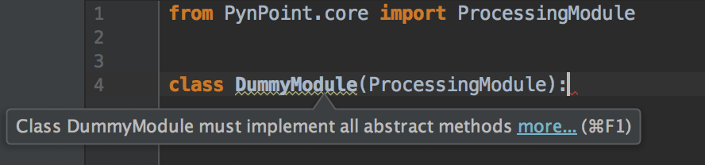

.. _own_module:

Writing own Pipeline Modules
============================

Getting Started
---------------

Before you start reading this chapter you should check your python knowledge. Beside the basics of python you need to know:

    * basics of the python |Types in Python| like lists, tupels and dictionaries
    * how |Classes in Python| work, particularly inheritance is important.
    * |ABC in Python| as interface

In addition you should know :ref:`pipeline-architecture`.

Processing Modules
------------------

As you should already know there are three different types of pipeline modules. Before you start implementing a module you need to choose one of them as an interface. Since all three module types are very similar we explain only how to write a processing module.

First we need to import the interface (i.e. abstract class) ProcessingModule: ::

    from PynPoint.core import ProcessingModule

All pipeline modules are classes which contain the parameters of the pipeline step, input ports and/or output ports. So let’s create a simple DummyModule class using the ProcessingModule interface (inheritance): ::
    
    class DummyModule(ProcessingModule):

If you are using an IDE like PyChar you might geht a warning like this:

The abstract class ProcessingModule has some abstract methods which have to be implemented by its children classes (i.e. __init__() and run()). Thus we have to implement the __init__() function (i.e. the constructor of our module): ::

    def __init__(self,
                 name_in="dummy",
                 in_tag_1="im_arr",
                 in_tag_2="im_arr2",
                 out_tag_1="result",
                 out_tag_2="result2”,
                 some_parameter=0):

Each __init__ function for a Pypeline module needs to have a name_in argument which is needed to run individual modules by name (please choose a default name). Furthermore we have to define input and output tags which can be set by the user in order to access data from the central database. As a next step we call the constructor of the ProcessingModule: ::
   
    super(DummyModule, self).__init__(name_in)

Next we can add the ports behind the tags which help us accessing the data from the central database:

        # Ports
        self.m_in_port_1 = self.add_input_port(in_tag_1)
        self.m_in_port_2 = self.add_input_port(in_tag_2)

        self.m_out_port_1 = self.add_output_port(out_tag_1)
        self.m_out_port_2 = self.add_output_port(out_tag_2)

You should always use the functions add_input_port and add_output_port in oder to add a Port! Do not add a Port by manually creating an instance of InputPort or OutputPort.
Last you need to save all parameters: ::

        self.m_parameter = some_parameter

Thats it! Now we can focus on the actual functionality of the module by writing the run() method which will be called by the Pypeline: ::

    def run(self):

You can use the input ports of your module to load data from the central database into the memory by using slicing or the get_all() function. Note: Be careful using the get_all() function if the data you are working with is larger than the memory of your computer! ::

        some_data = self.m_in_port_1.get_all()

        more_data = self.m_in_port_1[0:4]

You can access attributes (header information) by using: ::

        some_attribute_data = self.m_in_port_2.get_attribute("AIRMASS")

For more information about how to import data have a look at the package documentation :class:`PynPoint.core.DataIO.InputPort`. 

Next you can implement your algorithm. And finally write out the results using your output ports: ::

        # Do something useful here ...
        result = None
        other_result = [None, None]
        
        attribute_result = "bla"
        
        result2 = [1,2,3]
        
        # save results
        self.m_out_port_1.set_all(result)
        self.m_out_port_1.append(other_result)
        
        self.m_out_port_2.add_attribute(name="very_important_information",
                                        value=attribute_result)
        
        self.m_out_port_2[0:2] = result2

For more information about how to store data have a look at the package documentation :class:`PynPoint.core.DataIO.OutputPort`. 

.. |Classes in Python| raw:: html

   <a href="https://docs.python.org/3/tutorial/classes.html" target="_blank">classes</a>

.. |Types in Python| raw:: html

   <a href="https://docs.python.org/3/library/stdtypes.html" target="_blank">types</a>

.. |ABC in Python| raw:: html

   <a href="https://docs.python.org/2/library/abc.html" target="_blank">abstract classes</a>

Example
-------
The Dummy Module from above: ::

    from PynPoint.core import ProcessingModule

    class DummyModule(ProcessingModule):

        def __init__(self,
                     name_in="dummy",
                     in_tag_1="im_arr",
                     in_tag_2="im_arr2",
                     out_tag_1="result",
                     out_tag_2="result2",
                     some_parameter=0):

            super(DummyModule, self).__init__(name_in)

            # Ports
            self.m_in_port_1 = self.add_input_port(in_tag_1)
            self.m_in_port_2 = self.add_input_port(in_tag_2)

            self.m_out_port_1 = self.add_output_port(out_tag_1)
            self.m_out_port_2 = self.add_output_port(out_tag_2)

            self.m_parameter = some_parameter

        def run(self):

            some_data = self.m_in_port_1.get_all()

            more_data = self.m_in_port_1[0:4]

            some_attribute_data = self.m_in_port_2.get_attribute("AIRMASS")

            # Do something useful here ...
            result = None
            other_result = [None, None]

            attribute_result = "bla"

            result2 = [1,2,3]

            # save results
            self.m_out_port_1.set_all(result)
            self.m_out_port_1.append(other_result)

            self.m_out_port_2.add_attribute(name="very_important_information",
                                            value=attribute_result)

            self.m_out_port_2[0:2] = result2

Conventions
-----------

If you want us to include your module in the next PynPoint version please use |Pylint| to analyse your code. In addition use `m_` for class member names.

.. |Pylint| raw:: html

   <a href="https://www.pylint.org" target="_blank">pylint</a>

