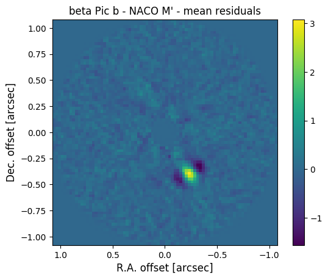

.. _quickstart:

Quickstart
==========

.. _installation:

Installation
------------

PynPoint is available in the |pypi| and on |github|. We recommend using a Python virtual environment to install and run PynPoint such that the correct versions of the dependencies can be installed without affecting other installed Python packages. First install `virtualenv` with the |pip|::

    $ pip install virtualenv

Then create a virtual environment, for example::

    $ virtualenv folder_name

And activate the environment with::

    $ source folder_name/bin/activate

PynPoint can now be installed with pip::

    $ pip install pynpoint

Alternatively, the repository can be cloned from Github (which contains the most recent implementations)::

    $ git clone git@github.com:PynPoint/PynPoint.git

In that case, the dependencies can be installed from the PynPoint folder::

    $ pip install -r requirements.txt

By adding the path of the repository to the `PYTHONPATH` environment variable enables PynPoint to be imported from any location::

    $ echo "export PYTHONPATH='$PYTHONPATH:/path/to/PynPoint'" >> folder_name/bin/activate

The installation can be tested by starting Python in interactive mode and printing the PynPoint version::

    >>> import PynPoint
    >>> print PynPoint.__version__

A virtual environment is deactivate with::

    $ deactivate

.. |pypi| raw:: html

   <a href="https://pypi.org/project/pynpoint/" target="_blank">PyPI repository</a>

.. |github| raw:: html

   <a href="https://github.com/PynPoint/PynPoint" target="_blank">Github</a>

.. |pip| raw:: html

   <a href="https://packaging.python.org/tutorials/installing-packages/" target="_blank">pip package manager</a>

.. _running:

Running PynPoint
----------------

As a quick start example, we provide a preprocessed data cube of beta Pic in the M' band (4.8 μm). This archival data set was obtained with the high-resolution, adaptive optics assisted, near-infrared camera at the Very Large Telescope under the ESO program ID |id|. The exposure time of the individual images was 65 ms and the total field rotation about 50 deg.

Each image in the data cube has been obtained with a pre-stacking of every 200 images. The data is stored in an HDF5 database (see :ref:`hdf5-files`) which contains a stack of 263 images of 80x80 in size, the parallactic angles, and the pixel scale of the detector. The following script downloads the data (13 MB), runs the PSF subtraction with PynPoint, and plots an image of the median residuals (make sure to adjust the path of ``working_place``, ``input_place``, and ``output_place``)::

    import urllib
    import numpy as np
    import matplotlib.pyplot as plt

    import PynPoint

    from PynPoint import Pypeline
    from PynPoint.IOmodules.Hdf5Reading import Hdf5ReadingModule
    from PynPoint.ProcessingModules import PSFpreparationModule, \
                                           PcaPsfSubtractionModule

    working_place = "/path/to/working_place/"
    input_place = "/path/to/input_place/"
    output_place = "/path/to/output_place/"

    # Python 2
    url = urllib.URLopener()
    url.retrieve("https://people.phys.ethz.ch/~stolkert/betapic_naco_mp.hdf5",
                 input_place+"betapic_naco_mp.hdf5")

    # Python 3
    # urllib.request.urlretrieve("https://people.phys.ethz.ch/~stolkert/betapic_naco_mp.hdf5",
    #                            input_place+"betapic_naco_mp.hdf5")

    pipeline = Pypeline(working_place_in=working_place,
                        input_place_in=input_place,
                        output_place_in=output_place)

    read = Hdf5ReadingModule(name_in="read",
                             input_filename="betapic_naco_mp.hdf5",
                             input_dir=None,
                             tag_dictionary={"stack":"stack"})

    pipeline.add_module(read)

    prep = PSFpreparationModule(name_in="prep",
                                image_in_tag="stack",
                                image_out_tag="prep",
                                mask_out_tag=None,
                                norm=False,
                                resize=None,
                                cent_size=0.15,
                                edge_size=1.1)

    pipeline.add_module(prep)

    pca = PcaPsfSubtractionModule(pca_numbers=(20, ),
                                  name_in="pca",
                                  images_in_tag="prep",
                                  reference_in_tag="prep",
                                  res_median_tag="residuals")

    pipeline.add_module(pca)

    pipeline.run()

    residuals = pipeline.get_data("residuals")
    pixscale = pipeline.get_attribute("stack", "PIXSCALE")

    size = pixscale*residuals.shape[-1]/2.

    plt.imshow(residuals[0, ], origin='lower', extent=[size, -size, -size, size])
    plt.title("beta Pic b - NACO M' - median residuals")
    plt.xlabel('R.A. offset [arcsec]', fontsize=12)
    plt.ylabel('Dec. offset [arcsec]', fontsize=12)
    plt.colorbar()
    plt.savefig(output_place+"residuals.png", bbox_inches='tight')

.. |id| raw:: html

   <a href="http://archive.eso.org/wdb/wdb/eso/sched_rep_arc/query?progid=090.C-0653(D)" target="_blank">090.C-0653(D)</a>

.. _detection:

Exoplanet Detection
-------------------

That's it! The median residuals of the PSF subtraction are stored in the central database and an image of the residuals has been saved in the ``output_place_in`` folder. The image shows the direct detection of the exoplanet |beta_pic_b|:

.. |beta_pic_b| raw:: html

   <a href="http://en.wikipedia.org/wiki/Beta_Pictoris_b" target="_blank">beta Pic b</a>

The star of this planetary system is located in the the center of the image, which is masked here, and the orientation of the image is such that North is up and East is left. The bright yellow feature in the bottom right direction is the planet beta Pic b. The angular separation from the central star is 457 mas and the brightness contrast is 7.65 mag. This means that beta Pic b is a factor 1148 fainter than the central star.
