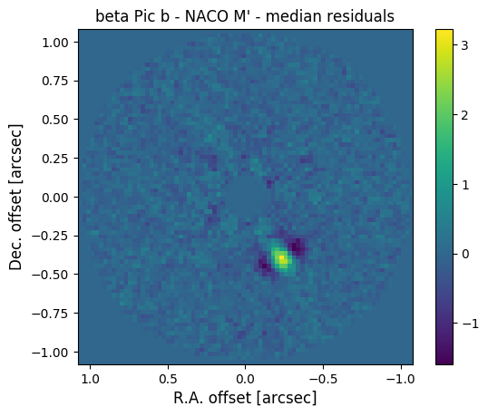

.. _running:

Running PynPoint
================

Introduction
------------

As a first example, we provide a preprocessed dataset of beta Pic in the M' filter (4.8 μm). This archival dataset was obtained with NACO at the Very Large Telescope under the ESO program ID |id|. The exposure time of the individual images was 65 ms and the total field rotation about 50 degrees. To limit the size of the dataset, every 200 images have been mean-collapsed. The data is stored in an HDF5 database (see :ref:`hdf5-files`) which contains 263 images of 80x80 pixels, the parallactic angles, and the pixel scale. The dataset is stored under the tag name ``stack``.

First Example
-------------

The following script downloads the data (13 MB), runs the PSF subtraction with PynPoint, and plots an image of the median-collapsed residuals::

    import os
    import urllib
    import matplotlib.pyplot as plt

    from pynpoint import Pypeline, \
                         Hdf5ReadingModule, \
                         PSFpreparationModule, \
                         PcaPsfSubtractionModule

    working_place = "/path/to/working_place/"
    input_place = "/path/to/input_place/"
    output_place = "/path/to/output_place/"

    data_url = "https://people.phys.ethz.ch/~stolkert/pynpoint/betapic_naco_mp.hdf5"
    data_loc = os.path.join(input_place, "betapic_naco_mp.hdf5")

    # Python 2
    # url = urllib.URLopener()
    # url.retrieve(data_url, data_loc)

    # Python 3
    urllib.request.urlretrieve(data_url, data_loc)

    pipeline = Pypeline(working_place_in=working_place,
                        input_place_in=input_place,
                        output_place_in=output_place)

    module = Hdf5ReadingModule(name_in="read",
                               input_filename="betapic_naco_mp.hdf5",
                               input_dir=None,
                               tag_dictionary={"stack":"stack"})

    pipeline.add_module(module)

    module = PSFpreparationModule(name_in="prep",
                                  image_in_tag="stack",
                                  image_out_tag="prep",
                                  mask_out_tag=None,
                                  norm=False,
                                  resize=None,
                                  cent_size=0.15,
                                  edge_size=1.1)

    pipeline.add_module(module)

    module = PcaPsfSubtractionModule(pca_numbers=(20, ),
                                     name_in="pca",
                                     images_in_tag="prep",
                                     reference_in_tag="prep",
                                     res_median_tag="residuals")

    pipeline.add_module(module)

    pipeline.run()

    residuals = pipeline.get_data("residuals")
    pixscale = pipeline.get_attribute("stack", "PIXSCALE")

    size = pixscale*residuals.shape[-1]/2.

    plt.imshow(residuals[0, ], origin='lower', extent=[size, -size, -size, size])
    plt.title("beta Pic b - NACO M' - median residuals")
    plt.xlabel('R.A. offset [arcsec]', fontsize=12)
    plt.ylabel('Dec. offset [arcsec]', fontsize=12)
    plt.colorbar()
    plt.savefig(os.path.join(output_place, "residuals.png"), bbox_inches='tight')

.. |id| raw:: html

   <a href="http://archive.eso.org/wdb/wdb/eso/sched_rep_arc/query?progid=090.C-0653(D)" target="_blank">090.C-0653(D)</a>

.. important::
   In the example, make sure to change the path of the ``working place``, ``input place``, and ``output place``. Also note the different use of ``urllib`` with Python 2 and Python 3.

Detection of beta Pic b
-----------------------

That's it! The residuals of the PSF subtraction are stored in the database under the tag name ``residuals`` and the plotted image is located in the ``output_place_in`` folder. The image shows the detection of the exoplanet |beta_pic_b|:

.. |beta_pic_b| raw:: html

   <a href="http://www.openexoplanetcatalogue.com/planet/beta%20Pic%20b/" target="_blank">beta Pic b</a>

The star of this planetary system is located in the center of the image (which is masked here) and the orientation of the image is such that North is up and East is left. The bright yellow feature in the bottom right direction is the planet beta Pic b at an angular separation of 0.46 arcseconds.
